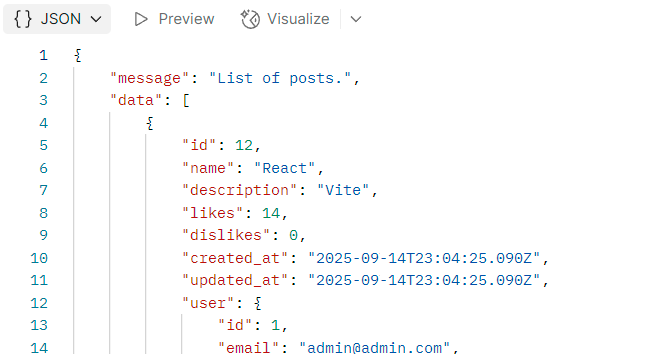

# Практично-лабораторне заняття №4
**Реалізація нової сутності, створення CRUD-операцій та відповідного RESTful API**

---

## 1. Створення сутності Post
**Файл:** `src/entities/Post.ts`

- Поля:
  - `id`: UUID, первинний ключ  
  - `title`: рядок, обов’язковий  
  - `content`: текст, необов’язковий  
  - `createdAt`: дата створення (автоматично)  
  - `updatedAt`: дата оновлення (автоматично)

*Скріншот: створення сутності Post*  

---

## 2. Міграція для Post
- Згенерувати міграцію для нової сутності.  
- Запустити міграцію через CLI.  
- Перевірити у базі даних (pgAdmin/psql), що таблиця створена коректно.  

*Скріншот застосування міграції*  

---

## 3. Реалізація RESTful API (CRUD)
Реалізовано контролер, DTO, сервіс і роутер за прикладом `User`.

- **Create:** створення нового поста  
- **Read:** отримання всіх постів або одного за ID  
- **Update:** оновлення поста за ID  
- **Delete:** видалення поста за ID  

*Скріншоти контролера, DTO, роутера та сервісу:*  
  
 

---

## 4. Опціонально: зв'язок User ↔ Post
- Один користувач може мати багато постів.  
- У моделі `Post` додано поле `user: ManyToOne`.  
- У моделі `User` додано поле `posts: OneToMany`.  
- У відповіді API:
  - Кожен пост містить інформацію про користувача (без пароля).  
  - У відповіді на запит користувача є масив його постів.  

*Скріншоти моделей:*  
  
   
 

---

## 5. Тестування REST API через Postman
- Створена колекція для запитів.  
- Додано приклади:
  - створення поста  
  - отримання всіх постів  
  - отримання поста за ID  
  - оновлення поста  
  - видалення поста  
  - [опціонально] отримання постів разом із користувачем та навпаки  

*Скріншоти тестів у Postman:*  
  
   
   
 

---

### Висновки
Додано сутність **Post**, створено для неї міграцію та реалізовано повний REST API (CRUD). Опціонально налаштовано зв’язок `User ↔ Post`. Робота протестована через Postman — всі ендпоінти працюють відповідно до очікувань.  

---
